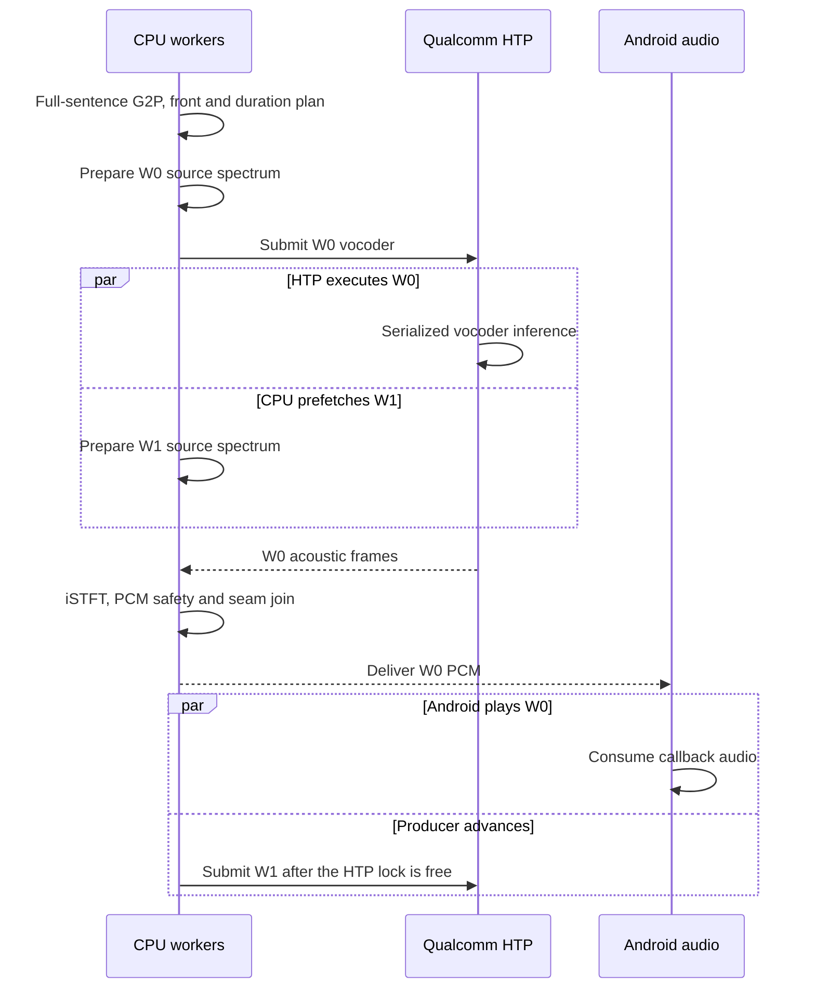

# Architecture

## Runtime pipeline

```text
text
  -> native Misaki/eSpeak G2P
  -> CPU full-sentence front (tokens, durations, style/intonation)
  -> duration-aligned, word-safe window planner
  -> CPU exact harmonic/source-spectrum prefix
  -> QNN HTP v75 neural-vocoder suffix (serialized)
  -> CPU iSTFT
  -> loudness/limiter + shared-timeline overlap
  -> Android SynthesisCallback (PCM16 mono, 24 kHz)
```

The opening HTP invocation and the next window's CPU-only source preparation
may run at the same time. HTP invocations themselves remain serialized behind
one use lock. After the first PCM arrives, Android playback becomes a third
pipeline stage while the producer stays approximately one window ahead.

This arrangement makes use of heterogeneous compute without creating two HTP
sessions that compete for the same accelerator. The Adreno GPU is not used.

## Why the graph is split

The original Kokoro v1 waveform path included a voiced harmonic source and
exact exponent-two operations that were numerically unsafe on the tested HTP
v75 runtime. The production graph therefore:

1. Rewrites 50 `Pow(x, 2)` nodes as mathematically identical `Mul(x, x)`.
2. Runs the small exact source-spectrum prefix on CPU.
3. Feeds that spectrum to the 1,153-node neural-vocoder suffix on HTP.
4. Runs the small iSTFT suffix on CPU.

This is not generic partitioning left to a runtime heuristic. It is an explicit
semantic cut whose boundary was validated against CPU reference output.

## Static contexts and sessions

Eleven QAIRT 2.48.40 AOT contexts cover 64 through 640 frames. Each artifact has
a pinned byte count and SHA-256 checked during Gradle configuration. A partial
bucket set disables QNN packaging rather than mixing graph generations.

QNN sessions set `session.disable_cpu_ep_fallback=1`. The provider is configured
for HTP v75 and `balanced` performance; a per-run option requests `burst` only
while inference is active. Selected large contexts receive 8 MiB VTCM. A
three-entry access-order LRU favors B128/B192/B208 after reading prewarm.

## Global duration planning

This is a context-first planner, not a split-first renderer:

1. Misaki/eSpeak produces one authoritative phoneme stream for the complete
   sentence.
2. Source-text boundary candidates are mapped onto that existing phoneme
   stream. A continuation is not independently phonemized.
3. The CPU front runs once over the complete stream with the selected voice and
   speed. It exports sentence-level conditioning, per-frame prosody/decoder
   tensors, and the exact duration of every BOS/token/EOS entry.
4. Candidate word boundaries are remapped onto the resulting duration-expanded
   frame timeline. Delimiter frames remain assigned, so no part of the original
   sentence path disappears between windows.
5. Overlong cores are word-safely refined with a hard depth bound of 16; tiny
   bridge fragments may be coalesced. Every mutation is remapped against the
   original duration vector rather than independently re-fronted.
6. Each bounded generator window shares the sentence-level conditioning tensor
   and receives slices of the same global prosody and decoder timeline. The
   window includes its disjoint output core plus available context around the
   boundary.

The opening is also duration-sized to provide useful playback runway for
continuation prefetch. Because these decisions use the voice-specific duration
path, a slow voice or unusual punctuation is not mistaken for an average
token-count estimate.

The practical result is whole-sentence context with progressive delivery:
context is computed globally and accelerator work is bounded locally. Each
core is emitted once, while shared boundary frames are blended once.

## Pipeline overlap in time



Only CPU-owned work overlaps an active HTP call. HTP invocations remain
serialized, preventing competing accelerator sessions, while Android playback
overlaps production of subsequent windows.

## Continuity and PCM safety

Adjacent global windows share 50 ms of timeline. The joiner uses complementary
raised-cosine gains and emits the overlap once, preventing duplicate speech.
Request edges reserve 120 ms before the next sentence and 30 ms after the
previous one to protect first-word onset.

PCM conditioning uses a robust p99.5 scale, 0.95 headroom, a continuous soft
limiter, and speech-band active-RMS loudness control. Gain is carried and ramped
through the stream with a 1 dB no-adjust corridor and a 6 dB cap.

## Failure behavior

The normal SM8650 route is QNN HTP. If preflight or runtime qualification fails,
the app can lazily create the monolithic q8 CPU model. Cache keys include
backend/context/retry identity, so a fallback result cannot masquerade as a
healthy HTP result. Cancellation closes the active path and Android completion
is delivered exactly once.
